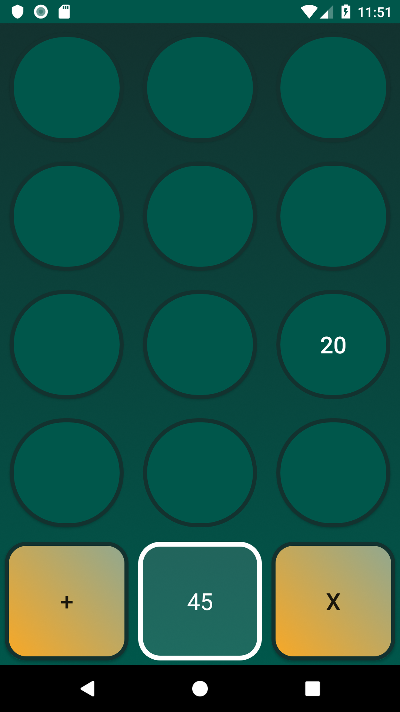

# Memory Game Project

## What is the Memory Game?
This is a simple game for Android 4.3+ built to test a users memory and ability to predict the result. There's a set of round "cards" with different numbers on it.


     
## Challenge
Get the maximum result of arithmetic operation with 3 numbers in 1 minute.

## Rules
* You can't see the intermediate result
* You can't use the same number twice
* Before you choose operator (**+** or **x**), you can see only 2 numbers at the same time
* After you choose operator (**+** or **x**), you won't have chance to check the numbers
* You have to use both **+** and **x**, each of them only once
* You have only 1 minute till the timer stops
```
For example: 
11 x 10 + 2 = 112 
11 + 10 x 2 = (11 + 10) x 2 = 42
```

## Instructions
* Click on a card
* Keep revealing cards and working your memory to remember each unveiled number
* Decide, what number will be the  first in arithmetic operation, and click it
* Click on + or x, depends on what operation you want to perform first
* Refresh in memory, what the second number shoud be, and click it. **You don't have a chance to click more than one number!**
* Click on a second operatot that you haven't used 
* Click on a third number
* Get your result, compare with your previous score and play again

## Tip
* _Try to remember as many numbers as possible **before** you start to calculate!_

## How to play?
Download .apk file to you Android phone and install it. Enjoy!

## How I built the Memory Game
I built the project in Android Studio, invent the app logic and also styled the game
* created a set of numbers that shuffles when game is refreshed
* created a counter for the number of clicks made by player and timer that counts down from 60 to 0
* implemented steps-logic that follows the chooses made by user
* add feature that saves and displays results of previous games
